<!-- ========================================================= -->
<!--                    ATHARV DESHMUKH                        -->
<!--                  GITHUB PROFILE README                    -->
<!-- ========================================================= -->


<!-- ======================== HERO =========================== -->

<p align="center">
  
</p>


<!-- ================= MOTTO + SOCIALS ======================= -->

<p>
  <code>Build with purpose. Improve with every version.</code>

  <a href="https://leetcode.com/u/Atharv__Deshmukh/" title="LeetCode">
    
  </a>
  <a href="mailto:its.atharvdeshmukh@gmail.com" title="Email">
    
  </a>
  <a href="https://www.linkedin.com/in/atharv-deshmukh-711909372/" title="LinkedIn">
    
  </a>
</p>
&nbsp;&nbsp;&nbsp;<sub>— My development motto</sub>


<!-- ======================== ABOUT ========================== -->

## About

Computer Engineering student **(B.Tech '27)** and full-stack developer focused on building practical, scalable software products.

I work across **backend architecture, REST APIs, MongoDB, authentication, AI integrations, prompt engineering, intelligent workflows, and HealthTech systems**.

Currently building and improving **HealthOrbit**, **MeshFlow**, and other full-stack projects while strengthening **DSA, backend engineering, prompt engineering, and system development**.


<!-- ======================== STACK ========================== -->

## Tech Stack

<div align="center">

  

</div>


<p align="center">
  <sub>
    Web Development • Backend Engineering • Android • Cloud • DevOps • APIs • AI Integration • Prompt Engineering
  </sub>
</p>


<!-- ======================= PROJECTS ======================== -->

## 🚀 Featured Projects

| Project | Overview | Technology |
|:---|:---|:---|
| **[HealthOrbit](https://github.com/Its-AtharvDeshmukh/HealthOrbit)** | AI-powered personal health intelligence platform connecting medical records, OCR, wearable telemetry, health history, timelines, trends, and context-aware AI assistance. | `Node.js` `Express` `MongoDB` `Kotlin` `Health Connect` `Gemini` |
| **[MeshFlow](https://github.com/Its-AtharvDeshmukh/MeshFlow)** | Multi-model AI orchestration system designed around DAG-based workflow routing, multiple LLM providers, structured execution pipelines, and execution telemetry. | `Node.js` `Express` `MongoDB` `OpenAI` `Gemini` |
| **[Roavista](https://github.com/Its-AtharvDeshmukh/Roavista)** | Full-stack accommodation marketplace with secure authentication, property management, interactive Mapbox discovery, Google OAuth, and Cloudinary-based media storage. | `Node.js` `Express` `MongoDB` `Passport.js` `Mapbox` `Cloudinary` |


<details>

<summary><strong>⚡ Explore project details</strong></summary>

<br>


### 01 — HealthOrbit

**AI-Powered Personal Health Intelligence Platform**

HealthOrbit is designed to bring fragmented personal health information into one connected ecosystem.

It combines:

- OCR-based medical report processing
- Structured health parameter extraction
- Android Health Connect integration
- Wearable telemetry synchronization
- Longitudinal Health Timeline
- Historical Health Trends
- Medicines and symptom tracking
- Context-aware AI assistance
- Family/caregiver permissions
- Emergency health information
- Insurance management
- Secure user-scoped access

**Architecture**

```text
 Medical Reports ─── OCR / Extraction ───┐
                                          │
 Wearable Data ───── Health Connect ──────┤
                                          │
 Medicines / Symptoms / Health Data ──────┤
                                          ▼
                                Node.js / Express
                                          │
                                          ▼
                                       MongoDB
                                          │
                   ┌──────────────────────┼─────────────────────┐
                   ▼                      ▼                     ▼
             Health Timeline        Health Trends         AI Context
                   │                      │                     │
                   └──────────────────────┴─────────────────────┘
                                          │
                                          ▼
                                     HealthOrbit
```

HealthOrbit is an information and assistance platform. Its AI features are designed to provide context and explanations, not autonomous diagnosis or prescribing.

---

### 02 — MeshFlow

**Multi-Model AI Orchestration System**

MeshFlow is designed as an AI orchestration system rather than a standard single-model chatbot.

The platform manages complex AI tasks through structured workflows and determines how different processing stages and AI providers participate in execution.

It focuses on:

- Multi-model AI integration
- Automated DAG workflow routing
- Structured execution pipelines
- Multi-stage task processing
- Backend-controlled AI execution
- Real-time execution telemetry
- Workflow-level observability
- Multiple LLM provider integrations
- Intelligent model routing
- Prompt engineering for structured AI instructions

The goal is to create a controlled execution layer where multiple models and workflow stages can work together instead of sending every request directly to a single model.

---

### 03 — Roavista

**Full-Stack Accommodation Marketplace**

Roavista is a property discovery and accommodation-management platform built around a complete server-side web architecture.

It includes:

- Property listings and management
- Secure authentication
- Google OAuth
- Interactive Mapbox maps
- Location-based property browsing
- Cloudinary image storage
- MongoDB persistence
- Responsive web interface
- Complete CRUD functionality

</details>


<!-- ====================== NEON DIVIDER ===================== -->

<br>


<!-- ================= EXPERIENCE & RECOGNITION ============== -->

## ⚡ Experience & Recognition

<p align="center">
  
</p>


<!-- ===================== HACKATHON ========================= -->

<a id="hackathon-details"></a>

<details>

<summary><strong>🏆 Hackathon 2026 — HealthOrbit Experience</strong></summary>

<br>

### HealthOrbit at Hackathon 2026

Participated in **Hackathon 2026** with **Team Fantastic 4**, presenting and demonstrating:

**HealthOrbit — Smart Personal Health Management & Emergency Detection**

During the hackathon, we demonstrated important parts of the platform including:

- HealthOrbit web platform
- Health Connect wearable telemetry
- Longitudinal Health Timeline
- Medical report processing
- AI-assisted health features
- Health data visualization
- Backend and database integration
- User-focused healthcare interface

### Judge Feedback

The judges gave **strong positive feedback** and particularly appreciated:

- the **project content**
- the **frontend UI**
- the project flow
- the presentation of health information
- the overall HealthOrbit concept
- the working implementation
- the way different technologies were connected into one platform

### What I Learned

The hackathon gave our team practical experience in:

- presenting a real technical product
- explaining architecture clearly
- demonstrating a live project
- answering judge questions
- working under time constraints
- solving last-minute development issues
- coordinating as a team
- receiving direct technical feedback

### Recognition

**Certificate of Participation — Hackathon 2026**

**Project:** HealthOrbit — Smart Personal Health Management & Emergency Detection  
**Team:** Fantastic 4

</details>


<!-- ================= FULL STACK ============================ -->

<details>

<summary><strong>💻 Full-Stack Development</strong></summary>

<br>

My full-stack work includes:

- Node.js
- Express.js
- MongoDB
- React
- EJS
- REST APIs
- MVC architecture
- Authentication
- Google OAuth
- Cloud integrations
- Responsive frontend development
- Deployment-oriented application development

Projects using these concepts include:

**HealthOrbit • MeshFlow • Roavista • OIBSIP Projects**

</details>


<!-- ================= AI =================================== -->

<details>

<summary><strong>🤖 AI Systems & Prompt Engineering</strong></summary>

<br>

My AI-focused development includes:

- OpenAI API integration
- Google Gemini integration
- Prompt engineering
- Structured prompt design
- Context-aware AI systems
- Multi-model workflows
- Structured AI pipelines
- Intelligent routing
- AI-assisted document interpretation
- Health context generation
- Backend-controlled AI execution

I use prompt engineering to create clearer instructions, manage context, improve structured outputs, and support reliable multi-stage AI workflows.

Main AI-oriented projects:

**MeshFlow • HealthOrbit**

</details>


<!-- ================= HEALTHTECH ============================ -->

<details>

<summary><strong>🩺 HealthTech</strong></summary>

<br>

HealthTech development currently focuses mainly on **HealthOrbit**.

Key areas include:

- Medical report OCR
- Structured health records
- Wearable telemetry
- Android Health Connect
- Health timelines
- Health trends
- Medicine tracking
- Symptom tracking
- Context-aware AI assistance
- Family/caregiver access
- Emergency health information

</details>


<!-- ================= BACKEND =============================== -->

<details>

<summary><strong>⚙️ Backend Engineering</strong></summary>

<br>

Backend development areas include:

- Node.js
- Express.js
- MongoDB
- Mongoose
- REST APIs
- Authentication
- Authorization
- Passport.js
- Mobile API authentication
- External API integrations
- Data normalization
- Server-side validation
- Secure user-scoped data access

</details>


<!-- ================= CERTIFICATIONS ======================== -->

<a id="certifications-learning"></a>

<details>

<summary><strong>🎓 Certifications & Learning</strong></summary>

<br>

| Certification / Recognition | Organization / Event |
|:---|:---|
| **Hackathon 2026 — Certificate of Participation** | Inter-College Hackathon 2026 |
| **Web Development & Designing Internship** | Oasis Infobyte |
| **Sigma 7 — Full-Stack Web Development (MERN)** | Apna College |
| **Data Structures & Algorithms in Java** | Apna College |

</details>


<!-- ====================== DIVIDER ========================== -->

<br>


<!-- =============== MINIMAL DEVELOPER ACTIVITY ============= -->

<details>

<summary>
  <strong>⚡ Developer Activity</strong>
  &nbsp;
  <sub>GitHub · LeetCode · Current Focus</sub>
</summary>

<br>

<p align="center">
  <a href="https://github.com/Its-AtharvDeshmukh"><strong>GitHub</strong></a>
  &nbsp; • &nbsp;
  <a href="https://leetcode.com/u/Atharv__Deshmukh/"><strong>LeetCode</strong></a>
</p>

<br>


<!-- GITHUB SNAPSHOT — HIDDEN UNTIL OPENED -->

<p align="center">
  <a
    href="https://github.com/Its-AtharvDeshmukh"
    title="Open my GitHub profile"
  >X
    
  </a>
</p>


<!-- CURRENT DEVELOPMENT CONSOLE — HIDDEN UNTIL OPENED -->

<br>

<p align="center">
  
</p>


<!-- FOOTER VISUAL — HIDDEN UNTIL OPENED -->

<br>

<p align="center">
  
</p>

</details>


<!-- ================= MINIMAL ENDING ======================== -->

<br>

<p align="center">
  <sub>
    <code>BUILD</code>
    &nbsp;→&nbsp;
    <code>TEST</code>
    &nbsp;→&nbsp;
    <code>SHIP</code>
    &nbsp;→&nbsp;
    <code>IMPROVE</code>
  </sub>
</p>
